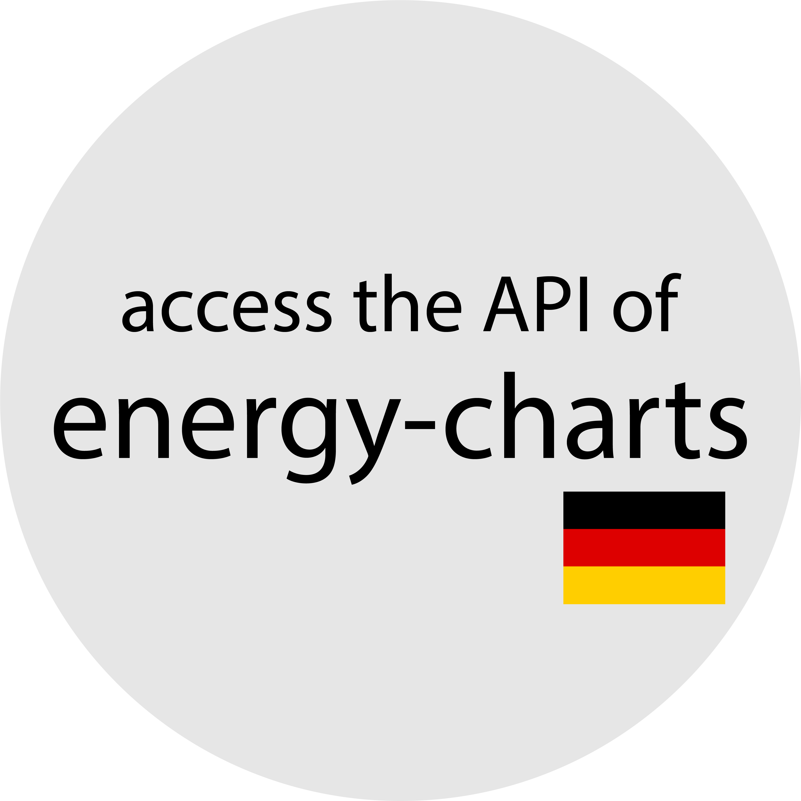

<!---
README.md for the `energy_charts_api` repository.
-->

<!-- PROJECT INFO -->
[![Contributors][contributors-shield]][contributors-url]
[![Forks][forks-shield]][forks-url]
[![Stargazers][stars-shield]][stars-url]
[![Issues][issues-shield]][issues-url]
[![License][license-shield]][license-url]

<!-- PROJECT LOGO -->
 

  

  <h3 align="center">MaStR</h3>

  

    Access the API of the energy-charts.info website.
     
    <a href="https://github.com/alexanderblinn/energy_charts_api/blob/main/README.md"><strong>Explore the docs »</strong></a>
     
     
    <a href="https://github.com/alexanderblinn/energy_charts_api/blob/main/README.md">View Demo</a>
    ·
    <a href="https://github.com/alexanderblinn/energy_charts_api/issues">Report Bug</a>
    ·
    <a href="https://github.com/alexanderblinn/energy_charts_api/issues">Request Feature</a>
  

<!-- TABLE OF CONTENTS -->

  
Table of Contents

  <ol>
    <li>
      <a href="#about-the-project">About The Project</a>
    </li>
    <li>
      <a href="#getting-started">Getting Started</a>
    </li>
    <li><a href="#usage">Usage</a></li>
    <li><a href="#contributing">Contributing</a></li>
    <li><a href="#license">License</a></li>
    <li><a href="#contact">Contact</a></li>
  </ol>

<!-- ABOUT THE PROJECT -->
## About The Project
The website energy-charts.info presents interactive graphics on electricity production and exchange electricity prices. The data is compiled by scientists at the Fraunhofer Institute for Solar Energy Systems ISE from various neutral sources. The data is available from 2011.

(<a href="#readme-top">back to top</a>)

<!-- GETTING STARTED -->
## Getting Started

To access the API of the energy-charts.info website, no prior steps (such as registration or similar) are required. No token is needed to download the data.

(<a href="#readme-top">back to top</a>)

<!-- USAGE EXAMPLES -->
## Usage

See `main.py` to learn how to use the EnergyChartsAPI class.

_For more information, check the official [website](https://api.energy-charts.info/)._

(<a href="#readme-top">back to top</a>)

<!-- CONTRIBUTING -->
## Contributing

Any contributions you make are **greatly appreciated**.

If you have a suggestion that would make this better, please fork the repo and create a pull request. You can also simply open an issue with the tag "enhancement".
Don't forget to give the project a star! Thanks again!

1. Fork the Project
2. Create your Feature Branch (`git checkout -b feature/AmazingFeature`)
3. Commit your Changes (`git commit -m 'Add some AmazingFeature'`)
4. Push to the Branch (`git push origin feature/AmazingFeature`)
5. Open a Pull Request

(<a href="#readme-top">back to top</a>)

<!-- LICENSE -->
## License

Distributed under the MIT License. See `LICENSE` for more information.

(<a href="#readme-top">back to top</a>)

<!-- CONTACT -->
## Contact

Project Link: [https://github.com/alexanderblinn/energy_charts_api](https://github.com/alexanderblinn/energy_charts_api)

E-Mail: [alexander.blinn@outlook.de](alexander.blinn@outlook.de)

(<a href="#readme-top">back to top</a>)

<!-- MARKDOWN LINKS & IMAGES -->
<!-- https://www.markdownguide.org/basic-syntax/#reference-style-links -->
[contributors-shield]: https://img.shields.io/github/contributors/alexanderblinn/energy_charts_api.svg?style=for-the-badge
[contributors-url]: https://github.com/alexanderblinn/energy_charts_api/graphs/contributors
[forks-shield]: https://img.shields.io/github/forks/alexanderblinn/energy_charts_api.svg?style=for-the-badge
[forks-url]: https://github.com/alexanderblinn/energy_charts_api/network/members
[stars-shield]: https://img.shields.io/github/stars/alexanderblinn/energy_charts_api.svg?style=for-the-badge
[stars-url]: https://github.com/alexanderblinn/energy_charts_api/stargazers
[issues-shield]: https://img.shields.io/github/issues/alexanderblinn/energy_charts_api.svg?style=for-the-badge
[issues-url]: https://github.com/alexanderblinn/energy_charts_api/issues
[license-shield]: https://img.shields.io/github/license/alexanderblinn/energy_charts_api.svg?style=for-the-badge
[license-url]: https://github.com/alexanderblinn/energy_charts_api/blob/main/LICENSE
